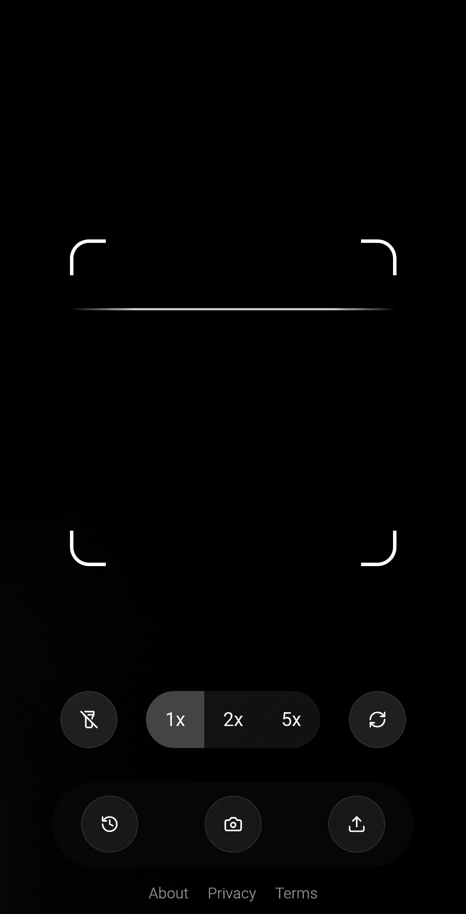

# QR Code Scanner

**A modern, feature-rich QR code scanner webapp designed to make scanning QR codes quick and effortless - with 100% local processing for complete privacy.**

  

## 🚀 Demo 

[QR Code Scanner](https://qrcodescanner.co)

## ✨ Key Features

### 📷 Direct Camera Scanning
- Scan QR codes instantly using your device's camera
- Real-time recognition with high accuracy

### 🔄 Camera Switching
- Easily switch between front and back cameras
- Perfect for different scanning scenarios

### 🔍 Image Upload
- Upload images containing QR codes from your gallery
- Ideal for scanning codes from screenshots or saved photos

### ⚙️ Advanced Controls
- Adjust zoom levels (1x, 2x, 5x) for scanning distant codes
- Toggle flash for better scanning in low-light conditions
- Support for WiFi QR code scanning

### 📱 Scan History
- View, search, and organize your scan history
- Sort by newest first
- One-tap access to previously scanned QR codes

### 🔒 Data Privacy
- 100% local processing - all scanning happens on your device
- No data is ever uploaded to external servers
- Complete privacy and security for your sensitive QR data

### 📊 URL Breakdown
- Automatic parsing of scanned URLs
- View domain, path, and protocol details
- Quick copy and open options

## 🛠️ Tech Stack

- React, Shadcn UI
- Progressive Web App (PWA) capabilities

## 💻 Browser Compatibility

- Works seamlessly on all modern browsers:
  - Chrome (recommended)
  - Firefox
  - Safari
  - Edge

## 📱 Mobile Support

- Responsive design for all screen sizes
- Works on iOS and Android devices
- Install as a PWA for app-like experience

## 🔧 Usage

1. **Direct Camera Scanning**:
   - Allow camera access when prompted
   - Point your camera at a QR code
   - Code will be automatically detected and processed

2. **Upload Image**:
   - Click the upload button
   - Select an image containing a QR code
   - The code will be processed instantly

3. **View Scan History**:
   - Access your scan history anytime
   - Search through previous scans
   - Easily copy or open previously scanned links

4. **Control Settings**:
   - Adjust zoom levels for better scanning
   - Toggle flash in low-light conditions
   - Enable/disable auto-open links after scanning

## 🙏 Acknowledgements

- [HTML5-QRCode](https://github.com/mebjas/html5-qrcode) for the QR code detection algorithm
- All contributors who have helped improve this project
- Icons provided by [Lucide Icons](https://lucide.dev/)
